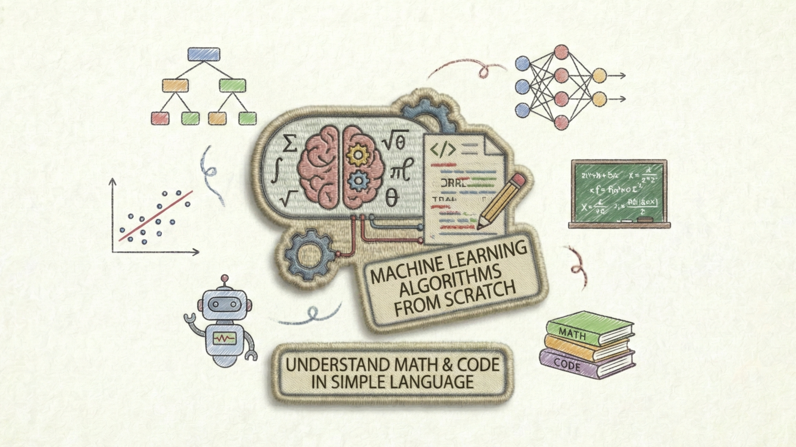

# Machine Learning Algorithms from Scratch



[](https://www.python.org/)
[](https://numpy.org/)
[](LICENSE)

> Learn machine learning by understanding the math and code behind the algorithms!

## 📚 About This Repository

This repository contains **clear, educational implementations** of essential machine learning algorithms built from scratch using only Python and NumPy. Each algorithm includes comprehensive documentation, mathematical explanations, and practical examples.

**Perfect for:**
- 🎓 Students learning machine learning fundamentals
- 👨‍💻 Developers wanting to understand algorithms deeply
- 📊 Data scientists preparing for technical interviews
- 🔬 Anyone curious about how ML algorithms actually work

## 🎯 Why Learn Algorithms from Scratch?

Machine learning libraries like scikit-learn are powerful, but they hide the inner workings. By implementing algorithms from scratch, you will:

- **Understand the Math**: See how mathematical formulas translate into code
- **Debug with Confidence**: Know what's happening under the hood when things go wrong
- **Optimize Better**: Make informed decisions about hyperparameters and model selection
- **Interview Ready**: Demonstrate deep understanding in technical interviews
- **Build Intuition**: Develop a mental model of how algorithms behave

### Learning vs. Production

⚠️ **Important Note**: These implementations prioritize **clarity and education** over performance. For production use, always use optimized libraries like scikit-learn, TensorFlow, or PyTorch.

## ✨ Key Features

- **📖 Comprehensive Documentation**: Each algorithm includes detailed markdown files explaining concepts, math, and implementation
- **💡 Step-by-Step Examples**: Real-world use cases with complete code examples
- **🧮 Mathematical Foundations**: Equations explained in plain language
- **📊 Visual Learning**: Code examples that can be easily visualized
- **🔧 Production-Like Code**: Clean, well-documented, reusable classes
- **🎓 Educational Focus**: Comments and explanations at every important step

## 📦 Repository Structure

```
ML-Algorithms-from-scratch/
│
├── 1. Linear Regression/
│   ├── _1_linear_regression.md      # Comprehensive guide
│   └── _1_linear_regressions.py     # Implementation
│
├── 2. Multiple Regression/
│   ├── _2_multiple_regression.md    # Comprehensive guide
│   └── _2_multiple_regression.py    # Implementation
│
├── 3. Ridge Regression/
│   ├── _3_ridge_regression.md       # Comprehensive guide
│   └── _3_ridge_regression.py       # Implementation
│
...
...
│
├── 21. Gaussian Mixture Models/
│   ├── _21_gmm.md                      # Comprehensive guide
│   └── _21_gmm.py                      # Implementation
│
├── 22. UMAP/
│   ├── _22_umap.md                     # Comprehensive guide
│   └── _22_umap.py                     # Implementation
│
├── 23. Hidden Markov Models/
│   ├── _23_hmm.md                      # Comprehensive guide
│   └── _23_hmm.py                      # Implementation
│
├── 24. Autoencoders/
│   ├── _24_autoencoders.md             # Comprehensive guide
│   └── _24_autoencoders.py             # Implementation
│
├── 25. LDA/
│   ├── _25_lda.md                      # Comprehensive guide
│   └── _25_lda.py                      # Implementation
│
├── 26. Prophet/
│   ├── _26_prophet.md                  # Comprehensive guide
│   └── _26_prophet.py                  # Implementation
│
├── 27. Learning-to-Rank/
│   ├── _27_learning_to_rank.md         # Comprehensive guide
│   └── _27_learning_to_rank.py         # Implementation
│
├── 28. Matrix Factorization/
│   ├── _28_matrix_factorization.md     # Comprehensive guide
│   └── _28_matrix_factorization.py     # Implementation
│
└── README.md                         # You are here!
```

Each algorithm folder contains:
- **`.py` file**: Clean, documented implementation with usage examples
- **`.md` file**: Detailed explanation with theory, math, and walkthroughs


## Algorithms Included

| #  | Algorithm                                                     | Status               | Documentation |
|----|---------------------------------------------------------------|----------------------|---------------|
| 1  | Linear Regression                                            | ✅ Implemented       | [View Details](1.%20Linear%20Regression/_1_linear_regression.md) |
| 2  | Multiple Regression                                          | ✅ Implemented       | [View Details](2.%20Multiple%20Regression/_2_multiple_regression.md) |
| 3  | Ridge Regression                                             | ✅ Implemented       | [View Details](3.%20Ridge%20Regression/_3_ridge_regression.md) |
| 4  | Logistic Regression                                          | ✅ Implemented       | [View Details](4.%20Logistic%20Regression/_4_logistic_regression.md) |
| 5  | K-Nearest Neighbors (KNN)                                    | ✅ Implemented       | [View Details](5.%20KNN/_5_knn.md) |
| 6  | Decision Trees                                               | ✅ Implemented       | [View Details](6.%20Decision%20Trees/_6_decision_trees.md) |
| 7  | Random Forests                                               | ✅ Implemented       | [View Details](7.%20Random%20Forests/_7_random_forests.md) |
| 8  | Support Vector Machines (SVM)                                | ✅ Implemented       | [View Details](8.%20SVM/_8_svm.md) |
| 9  | Naive Bayes                                                  | ✅ Implemented       | [View Details](9.%20Naive%20Bayes/_9_naive_bayes.md) |
| 10 | k-Means Clustering                                           | ✅ Implemented       | [View Details](10.%20k-Means%20Clustering/_10_kmeans_clustering.md) |
| 11 | Principal Component Analysis (PCA)                           | ✅ Implemented       | [View Details](11.%20PCA/_11_pca.md) |
| 12 | Hierarchical Clustering                                      | ✅ Implemented       | [View Details](12.%20Hierarchical%20Clustering/_12_hierarchical_clustering.md) |
| 13 | Apriori Algorithm (Association Rule Mining)                  | ✅ Implemented       | [View Details](13.%20Apriori/_13_apriori.md) |
| 14 | t-Distributed Stochastic Neighbor Embedding (t-SNE)          | ✅ Implemented       | [View Details](14.%20t-SNE/_14_tsne.md) |
| 15 | AdaBoost (Adaptive Boosting)                                 | ✅ Implemented       | [View Details](15.%20AdaBoost/_15_adaboost.md) |
| 16 | Gradient Boosting                                            | ✅ Implemented       | [View Details](16.%20Gradient%20Boosting/_16_gradient_boosting.md) |
| 17 | Xtreme Gradient Boosting (XGBoost)                           | ✅ Implemented       | [View Details](17.%20XGBoost/_17_xgboost.md) |
| 18 | LightGBM (Light Gradient Boosting Machine)                   | ✅ Implemented       | [View Details](18.%20LightGBM/_18_lightgbm.md) |
| 19 | CatBoost (Categorical Boosting)                              | ✅ Implemented       | [View Details](19.%20CatBoost/_19_catboost.md) |
| 20 | Isolation Forest                                             | ✅ Implemented       | [View Details](20.%20Isolation%20Forest/_20_isolation_forest.md) |
| 21 | Gaussian Mixture Models (GMM)                                | ✅ Implemented       | [View Details](21.%20Gaussian%20Mixture%20Models/_21_gmm.md) |
| 22 | UMAP (Uniform Manifold Approximation and Projection)         | ✅ Implemented       | [View Details](22.%20UMAP/_22_umap.md) |
| 23 | Hidden Markov Models (HMM)                                   | ✅ Implemented       | [View Details](23.%20Hidden%20Markov%20Models/_23_hmm.md) |
| 24 | Autoencoders                                                 | ✅ Implemented       | [View Details](24.%20Autoencoders/_24_autoencoders.md) |
| 25 | Latent Dirichlet Allocation (LDA)                            | ✅ Implemented       | [View Details](25.%20LDA/_25_lda.md) |
| 26 | Prophet (Time Series Forecasting)                            | ✅ Implemented       | [View Details](26.%20Prophet/_26_prophet.md) |
| 27 | Learning-to-Rank (LambdaRank)                                | ✅ Implemented       | [View Details](27.%20Learning-to-Rank/_27_learning_to_rank.md) |
| 28 | Matrix Factorization (Collaborative Filtering)               | ✅ Implemented       | [View Details](28.%20Matrix%20Factorization/_28_matrix_factorization.md) |


## 🚀 Getting Started

### Prerequisites

Before you begin, ensure you have:
- **Python 3.7 or higher** installed on your system
- **NumPy library** (for numerical computations)
- **Optional**: matplotlib (for visualizations), scikit-learn (for comparison and datasets)

### Installation

1. **Clone the repository:**
```bash
git clone https://github.com/inboxpraveen/ML-Algorithms-from-scratch.git
cd ML-Algorithms-from-scratch
```

2. **Install required dependencies:**
```bash
pip install numpy

# Optional: Install these for running examples and visualizations
pip install matplotlib scikit-learn
```

### Quick Start

All algorithms in this repository follow a consistent, simple interface:

1. **Import** the algorithm class from its folder
2. **Create** an instance of the class
3. **Train** the model using `.fit(X_train, y_train)`
4. **Predict** on new data using `.predict(X_test)`
5. **Evaluate** performance using `.score(X_test, y_test)` (where available)

Each algorithm folder contains complete code examples in both the `.py` and `.md` files showing exactly how to use that specific algorithm with real data.

### How to Use This Repository

1. **Browse the Algorithms Table** below to find an algorithm
2. **Read the Documentation** (click "View Details") to understand the theory
3. **Study the Code** in the `.py` file - it's heavily commented
4. **Run the Examples** provided in the usage section of each file
5. **Experiment** - modify parameters, try your own data!

### Learning Path

**Recommended order for beginners:**

1. **Start with Linear Regression** - Simplest algorithm, foundation for others
2. **Move to Multiple Regression** - Understand multiple features
3. **Try Classification** - Logistic Regression (coming soon)
4. **Explore Non-linear** - Decision Trees, KNN (coming soon)

Each algorithm builds on concepts from previous ones!


## 🎓 What You'll Learn

For each algorithm, you'll understand:

- **The Problem It Solves**: When and why to use this algorithm
- **Mathematical Foundation**: The equations and theory behind it
- **Step-by-Step Implementation**: How math translates to code
- **Practical Applications**: Real-world use cases
- **Model Evaluation**: How to measure performance
- **Advantages & Limitations**: When to use (or not use) the algorithm

## 📖 Documentation Quality

Each algorithm includes:

- **Comprehensive Guide** (`.md` file):
  - Intuitive explanations with real-world analogies
  - Mathematical formulas broken down step-by-step
  - Implementation details explained
  - Complete examples with output
  - Visualization suggestions
  - Links to further resources

- **Clean Implementation** (`.py` file):
  - Class-based design for reusability
  - Detailed docstrings for all methods
  - Inline comments explaining key steps
  - Multiple usage examples
  - Type hints and parameter documentation

## 🤝 Contributing

Contributions are welcome and appreciated! Here's how you can help:

### Ways to Contribute

- 🐛 **Report Bugs**: Open an issue if you find a bug
- 💡 **Suggest Algorithms**: Request algorithms you'd like to see
- 📝 **Improve Documentation**: Fix typos, add clarity, include examples
- 🔧 **Enhance Code**: Optimize implementations (while keeping clarity)
- ✅ **Add Tests**: Help ensure correctness
- 🎨 **Create Visualizations**: Add plots and diagrams

### Contribution Guidelines

When contributing, please:
1. Follow the existing code style (clean, well-documented, educational)
2. Include comprehensive docstrings and comments
3. Add usage examples in the code
4. Update or create corresponding `.md` documentation
5. Ensure code works with NumPy only (no additional ML libraries for core implementation)
6. Test your implementation with example datasets

**Note**: The goal is education, not performance. Prioritize clarity over optimization.

## ❓ Frequently Asked Questions

**Q: Should I use this code in production?**  
A: No, these implementations prioritize learning over performance. Use scikit-learn, TensorFlow, or PyTorch for production.

**Q: Do I need to know advanced math?**  
A: Basic knowledge helps, but each algorithm includes math explanations in plain language.

**Q: Can I compare these with scikit-learn?**  
A: Absolutely! Many examples show how to use scikit-learn for comparison and validation.

**Q: Why NumPy only?**  
A: To focus on fundamentals. Understanding NumPy operations helps you understand what libraries do internally.

**Q: How long does it take to learn each algorithm?**  
A: With the documentation provided, expect 1-2 hours per algorithm for thorough understanding.

## 📚 Additional Resources

- [NumPy Documentation](https://numpy.org/doc/stable/)
- [Scikit-learn Documentation](https://scikit-learn.org/)
- [Machine Learning Coursera (Andrew Ng)](https://www.coursera.org/learn/machine-learning)
- [Deep Learning Book](https://www.deeplearningbook.org/)
- [StatQuest YouTube Channel](https://www.youtube.com/user/joshstarmer) - Great visual explanations

## 📄 License

This project is licensed under the MIT License - see the [LICENSE](LICENSE) file for details.

## 🙏 Acknowledgments

This repository is built for the community of learners who believe in understanding fundamentals. Special thanks to all contributors and the open-source community.

## ⭐ Support This Project

If you find this repository helpful:
- ⭐ **Star this repository** to help others discover it
- 🔄 **Share it** with fellow learners
- 🤝 **Contribute** an algorithm or improvement
- 📢 **Provide feedback** through issues

---

## 💬 Final Thoughts

> "Learning machine learning from scratch is like learning to cook from scratch - you could just buy premade meals (use libraries), but understanding ingredients and techniques (algorithms and math) makes you a better chef (data scientist)!"

Understanding the core concepts of machine learning algorithms is essential for anyone looking to excel in the field of data science and artificial intelligence. This repository aims to provide a comprehensive and accessible resource for learning and experimenting with various machine learning algorithms from scratch.

**Happy Learning and Coding!** 🚀📊🤖

---

**Maintained by [@inboxpraveen](https://github.com/inboxpraveen) | Last Updated: March 2026**