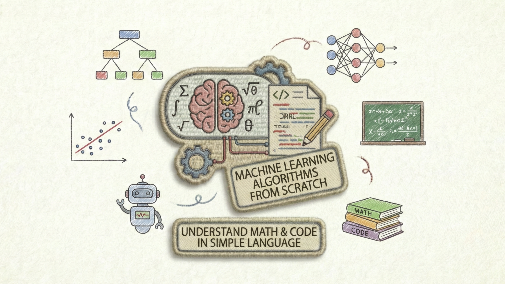

# Machine Learning Algorithms from Scratch



[](https://www.python.org/)
[](https://numpy.org/)
[](LICENSE)

> Learn machine learning by understanding the math and code behind the algorithms!

## 📚 About This Repository

This repository contains **clear, educational implementations** of essential machine learning algorithms built from scratch using only Python and NumPy. Each algorithm includes comprehensive documentation, mathematical explanations, and practical examples.

**Perfect for:**
- 🎓 Students learning machine learning fundamentals
- 👨‍💻 Developers wanting to understand algorithms deeply
- 📊 Data scientists preparing for technical interviews
- 🔬 Anyone curious about how ML algorithms actually work

## 🎯 Why Learn Algorithms from Scratch?

Machine learning libraries like scikit-learn are powerful, but they hide the inner workings. By implementing algorithms from scratch, you will:

- **Understand the Math**: See how mathematical formulas translate into code
- **Debug with Confidence**: Know what's happening under the hood when things go wrong
- **Optimize Better**: Make informed decisions about hyperparameters and model selection
- **Interview Ready**: Demonstrate deep understanding in technical interviews
- **Build Intuition**: Develop a mental model of how algorithms behave

### Learning vs. Production

⚠️ **Important Note**: These implementations prioritize **clarity and education** over performance. For production use, always use optimized libraries like scikit-learn, TensorFlow, or PyTorch.

## ✨ Key Features

- **▶️ Runs Out of the Box**: `python "<any file>"` trains the model and prints results — NumPy only, no setup, no dataset to download
- **📖 Comprehensive Documentation**: Each algorithm includes detailed markdown files explaining concepts, math, and implementation
- **💡 Step-by-Step Examples**: Real-world use cases with complete code examples
- **🧮 Mathematical Foundations**: Equations derived in plain language, then mapped onto the code that implements them
- **🔬 Checked Against the Real Thing**: Compared to scikit-learn/SciPy where they exist, and to the original papers where they don't
- **📊 Visual Learning**: Code examples that can be easily visualized
- **🔧 Clean, Reusable Code**: Well-documented classes with a consistent interface
- **🙊 No Hidden Hand-Waving**: Where an implementation simplifies the canonical algorithm, it says so and explains the cost
- **🎓 Educational Focus**: Comments and explanations at every important step

## 📦 Repository Structure

```
ML-Algorithms-from-scratch/
│
├── 1. Linear Regression/
│   ├── _1_linear_regression.md      # Comprehensive guide
│   └── _1_linear_regressions.py     # Implementation
│
├── 2. Multiple Regression/
│   ├── _2_multiple_regression.md    # Comprehensive guide
│   └── _2_multiple_regression.py    # Implementation
│
├── 3. Ridge Regression/
│   ├── _3_ridge_regression.md       # Comprehensive guide
│   └── _3_ridge_regression.py       # Implementation
│
...
...
│
├── 21. Gaussian Mixture Models/
│   ├── _21_gmm.md                      # Comprehensive guide
│   └── _21_gmm.py                      # Implementation
│
├── 22. UMAP/
│   ├── _22_umap.md                     # Comprehensive guide
│   └── _22_umap.py                     # Implementation
│
├── 23. Hidden Markov Models/
│   ├── _23_hmm.md                      # Comprehensive guide
│   └── _23_hmm.py                      # Implementation
│
├── 24. Autoencoders/
│   ├── _24_autoencoders.md             # Comprehensive guide
│   └── _24_autoencoders.py             # Implementation
│
├── 25. LDA/
│   ├── _25_lda.md                      # Comprehensive guide
│   └── _25_lda.py                      # Implementation
│
├── 26. Prophet/
│   ├── _26_prophet.md                  # Comprehensive guide
│   └── _26_prophet.py                  # Implementation
│
├── 27. Learning-to-Rank/
│   ├── _27_learning_to_rank.md         # Comprehensive guide
│   └── _27_learning_to_rank.py         # Implementation
│
├── 28. Matrix Factorization/
│   ├── _28_matrix_factorization.md     # Comprehensive guide
│   └── _28_matrix_factorization.py     # Implementation
│
└── README.md                         # You are here!
```

Each algorithm folder contains:
- **`.py` file**: Clean, documented implementation with usage examples
- **`.md` file**: Detailed explanation with theory, math, and walkthroughs


## Algorithms Included

| #  | Algorithm                                                     | Status               | Documentation |
|----|---------------------------------------------------------------|----------------------|---------------|
| 1  | Linear Regression                                            | ✅ Implemented       | [View Details](1.%20Linear%20Regression/_1_linear_regression.md) |
| 2  | Multiple Regression                                          | ✅ Implemented       | [View Details](2.%20Multiple%20Regression/_2_multiple_regression.md) |
| 3  | Ridge Regression                                             | ✅ Implemented       | [View Details](3.%20Ridge%20Regression/_3_ridge_regression.md) |
| 4  | Logistic Regression                                          | ✅ Implemented       | [View Details](4.%20Logistic%20Regression/_4_logistic_regression.md) |
| 5  | K-Nearest Neighbors (KNN)                                    | ✅ Implemented       | [View Details](5.%20KNN/_5_knn.md) |
| 6  | Decision Trees                                               | ✅ Implemented       | [View Details](6.%20Decision%20Trees/_6_decision_trees.md) |
| 7  | Random Forests                                               | ✅ Implemented       | [View Details](7.%20Random%20Forests/_7_random_forests.md) |
| 8  | Support Vector Machines (SVM)                                | ✅ Implemented       | [View Details](8.%20SVM/_8_svm.md) |
| 9  | Naive Bayes                                                  | ✅ Implemented       | [View Details](9.%20Naive%20Bayes/_9_naive_bayes.md) |
| 10 | k-Means Clustering                                           | ✅ Implemented       | [View Details](10.%20k-Means%20Clustering/_10_kmeans_clustering.md) |
| 11 | Principal Component Analysis (PCA)                           | ✅ Implemented       | [View Details](11.%20PCA/_11_pca.md) |
| 12 | Hierarchical Clustering                                      | ✅ Implemented       | [View Details](12.%20Hierarchical%20Clustering/_12_hierarchical_clustering.md) |
| 13 | Apriori Algorithm (Association Rule Mining)                  | ✅ Implemented       | [View Details](13.%20Apriori/_13_apriori.md) |
| 14 | t-Distributed Stochastic Neighbor Embedding (t-SNE)          | ✅ Implemented       | [View Details](14.%20t-SNE/_14_tsne.md) |
| 15 | AdaBoost (Adaptive Boosting)                                 | ✅ Implemented       | [View Details](15.%20AdaBoost/_15_adaboost.md) |
| 16 | Gradient Boosting                                            | ✅ Implemented       | [View Details](16.%20Gradient%20Boosting/_16_gradient_boosting.md) |
| 17 | Xtreme Gradient Boosting (XGBoost)                           | ✅ Implemented       | [View Details](17.%20XGBoost/_17_xgboost.md) |
| 18 | LightGBM (Light Gradient Boosting Machine)                   | ✅ Implemented       | [View Details](18.%20LightGBM/_18_lightgbm.md) |
| 19 | CatBoost (Categorical Boosting)                              | ✅ Implemented       | [View Details](19.%20CatBoost/_19_catboost.md) |
| 20 | Isolation Forest                                             | ✅ Implemented       | [View Details](20.%20Isolation%20Forest/_20_isolation_forest.md) |
| 21 | Gaussian Mixture Models (GMM)                                | ✅ Implemented       | [View Details](21.%20Gaussian%20Mixture%20Models/_21_gmm.md) |
| 22 | UMAP (Uniform Manifold Approximation and Projection)         | ✅ Implemented       | [View Details](22.%20UMAP/_22_umap.md) |
| 23 | Hidden Markov Models (HMM)                                   | ✅ Implemented       | [View Details](23.%20Hidden%20Markov%20Models/_23_hmm.md) |
| 24 | Autoencoders                                                 | ✅ Implemented       | [View Details](24.%20Autoencoders/_24_autoencoders.md) |
| 25 | Latent Dirichlet Allocation (LDA)                            | ✅ Implemented       | [View Details](25.%20LDA/_25_lda.md) |
| 26 | Prophet (Time Series Forecasting)                            | ✅ Implemented       | [View Details](26.%20Prophet/_26_prophet.md) |
| 27 | Learning-to-Rank (LambdaRank)                                | ✅ Implemented       | [View Details](27.%20Learning-to-Rank/_27_learning_to_rank.md) |
| 28 | Matrix Factorization (Collaborative Filtering)               | ✅ Implemented       | [View Details](28.%20Matrix%20Factorization/_28_matrix_factorization.md) |


## 🚀 Getting Started

### Prerequisites

Before you begin, ensure you have:
- **Python 3.7 or higher** installed on your system
- **NumPy library** (for numerical computations)
- **Optional**: matplotlib (for visualizations), scikit-learn (for comparison and datasets)

### Installation

1. **Clone the repository:**
```bash
git clone https://github.com/inboxpraveen/ML-Algorithms-from-scratch.git
cd ML-Algorithms-from-scratch
```

2. **Install required dependencies:**
```bash
pip install numpy

# Optional: only needed for some of the extended examples inside the docs,
# which compare against reference implementations or draw plots.
pip install matplotlib scikit-learn
```

**NumPy is the only requirement.** Every algorithm, and every runnable demo in every file,
works with NumPy alone — including the boosting family, where the point is to see the
algorithm rather than call a library.

### Quick Start

**Every algorithm runs on its own, right now, with nothing but NumPy installed.** Pick any
file and run it:

```bash
python "1. Linear Regression/_1_linear_regressions.py"
python "17. XGBoost/_17_xgboost.py"
python "23. Hidden Markov Models/_23_hmm.py"
```

Each file ends in a **Plug-and-Play Demo** that builds a small synthetic dataset, trains the
model, and prints training and test scores plus a few sample predictions. Nothing to edit,
no dataset to download, no arguments to pass. Every demo is seeded, so you get the same
numbers the documentation quotes, and every one finishes in seconds.

The matching `.md` file opens with a **Quick Start: Plug-and-Play Example** section
containing that same script and its expected output, so you can read what a model does
before you read how it works.

Once you want to use an algorithm on your own data, they share a consistent interface:

1. **Import** the algorithm class from its folder
2. **Create** an instance of the class
3. **Train** the model using `.fit(X_train, y_train)`
4. **Predict** on new data using `.predict(X_test)`
5. **Evaluate** performance using `.score(X_test, y_test)`

Dimensionality-reduction algorithms (PCA, t-SNE, UMAP, Autoencoders) use
`.fit_transform(X)` instead, and clustering algorithms add `.fit_predict(X)`. A few
algorithms with no meaningful `fit/predict` shape — Apriori, HMM, Prophet — keep the API
that is natural to them, documented in their own files.

### How to Use This Repository

1. **Run the file** — `python "6. Decision Trees/_6_decision_trees.py"` — and see the
   algorithm work before reading a single line about it
2. **Read the Quick Start** at the top of the matching `.md` to understand what just happened
3. **Read the Documentation** (click "View Details") for the intuition and the mathematics
4. **Study the Code** in the `.py` file — it's heavily commented, and the formulas in the
   docs map directly onto the lines that implement them
5. **Experiment** — modify parameters, try your own data!

### Learning Path

The numbering is the recommended order — each algorithm leans on ideas from the ones before
it. If you are starting out, work through the stages rather than jumping to the famous names
at the end; XGBoost makes far more sense once you have built a decision tree by hand.

**Stage 1 — Foundations (1-4).** Start with **Linear Regression**: one feature, a closed-form
solution, and the whole idea of fitting a model to data. **Multiple Regression** generalises
it to many features, **Ridge Regression** introduces regularization — your first encounter
with the bias-variance trade-off — and **Logistic Regression** turns regression into
classification and brings in gradient descent.

**Stage 2 — Core classifiers (5-9).** **KNN** is the simplest possible classifier and needs
no training at all. **Decision Trees** introduce splitting criteria and are the single most
important prerequisite in this repo — seven later algorithms are built out of them.
**Random Forests** show why averaging many decorrelated models beats one good one. **SVM**
brings margins and the kernel trick; **Naive Bayes** brings the probabilistic view.

**Stage 3 — Unsupervised learning (10-13).** **k-Means** and **Hierarchical Clustering**
find structure without labels, **PCA** introduces dimensionality reduction through
eigenvectors, and **Apriori** mines association rules — a different kind of pattern entirely.

**Stage 4 — Boosting (14-19).** Read these in order; they are a single conversation.
**t-SNE** is the exception here (a visualization method — take it alongside PCA).
**AdaBoost** introduces the idea of training models on the mistakes of earlier ones,
**Gradient Boosting** reframes that as gradient descent in function space, and **XGBoost**
adds second-order optimization and regularization. **LightGBM** and **CatBoost** then each
change one thing: leaf-wise growth, and ordered target statistics for categorical features.

**Stage 5 — Specialised methods (20-28).** Pick by what you need. Anomaly detection
(**Isolation Forest**), probabilistic clustering (**GMM**), manifold learning (**UMAP**),
sequence models (**HMM**), neural representation learning (**Autoencoders**), topic modelling
(**LDA**), forecasting (**Prophet**), search ranking (**Learning-to-Rank**), and
recommendations (**Matrix Factorization**).

**A suggestion:** run the file first, then read the maths. Watching a model score 0.98 and
then finding out why is a better order than the reverse.


## 🎓 What You'll Learn

For each algorithm, you'll understand:

- **The Problem It Solves**: When and why to use this algorithm
- **Mathematical Foundation**: The equations and theory behind it
- **Step-by-Step Implementation**: How math translates to code
- **Practical Applications**: Real-world use cases
- **Model Evaluation**: How to measure performance
- **Advantages & Limitations**: When to use (or not use) the algorithm

## 📖 Documentation Quality

Each algorithm includes:

- **Comprehensive Guide** (`.md` file):
  - A **Quick Start** at the top: a runnable script and the output it actually produces
  - Intuitive explanations with real-world analogies
  - Mathematical formulas derived step-by-step, then mapped onto the lines that implement them
  - Complete examples with output measured from a real run, not written from memory
  - An honest **Simplifications** section wherever this implementation departs from the
    canonical algorithm, naming what is different and what it costs
  - Links to the original papers and further resources

- **Clean Implementation** (`.py` file):
  - Class-based design for reusability
  - Detailed docstrings for every method, stating the formula it implements
  - Every parameter documented with its type, default, effect, and a typical range
  - Inline comments at each non-obvious mathematical step
  - Multiple usage examples, each one executed to confirm it works
  - A **Plug-and-Play Demo** you can run with `python <file>` — NumPy only, seeded, fast

## 🤝 Contributing

Contributions are welcome and appreciated! Here's how you can help:

### Ways to Contribute

- 🐛 **Report Bugs**: Open an issue if you find a bug
- 💡 **Suggest Algorithms**: Request algorithms you'd like to see
- 📝 **Improve Documentation**: Fix typos, add clarity, include examples
- 🔧 **Enhance Code**: Optimize implementations (while keeping clarity)
- ✅ **Add Tests**: Help ensure correctness
- 🎨 **Create Visualizations**: Add plots and diagrams

### Contribution Guidelines

When contributing, please:
1. Follow the existing code style (clean, well-documented, educational)
2. Include comprehensive docstrings and comments — every parameter gets its type, default,
   effect, and a typical range; every method states the formula it implements
3. Add usage examples in the code, and **run every one of them** before submitting
4. End the file with an `if __name__ == "__main__":` Plug-and-Play Demo: NumPy only,
   seeded with `np.random.seed(42)`, ASCII-only output, finishing in seconds
5. Update or create corresponding `.md` documentation, opening with a **Quick Start** whose
   expected output you captured from a real run
6. Ensure code works with NumPy only (no additional ML libraries for core implementation)
7. Validate against the canonical algorithm — scikit-learn or SciPy where an equivalent
   exists, otherwise a problem whose answer you can compute by hand
8. Quote no number you have not measured. If your implementation simplifies the canonical
   algorithm, add a **Simplifications** section saying what differs and what it costs

**Note**: The goal is education, not performance. Prioritize clarity over optimization —
but not over correctness. An implementation that is clear and wrong teaches the wrong thing.

## ❓ Frequently Asked Questions

**Q: Should I use this code in production?**  
A: No, these implementations prioritize learning over performance. Use scikit-learn, TensorFlow, or PyTorch for production.

**Q: Do I need to know advanced math?**  
A: Basic knowledge helps, but each algorithm includes math explanations in plain language.

**Q: Can I compare these with scikit-learn?**  
A: Absolutely, and you should — many examples do exactly that. These implementations are
checked against their canonical counterparts: where scikit-learn or SciPy has an equivalent,
the results are expected to match closely, and where no library exists (XGBoost, LightGBM,
CatBoost, UMAP, HMM, Prophet, Learning-to-Rank, Matrix Factorization) the implementation is
checked against the formulas in the original paper and against problems with a known answer.
Where an implementation deliberately simplifies, its `.md` says so in a **Simplifications**
section rather than leaving you to discover it.

**Q: How close are these to the real thing?**  
A: Close on the mathematics, not on the engineering. The goal is that the algorithm behaves
like the canonical one — same update rules, same objective, comparable accuracy on the same
data. What you will not find is the engineering that makes production libraries fast:
histogram-based split finding at scale, multithreading, cache-aware memory layouts, GPU
kernels, or distributed training. A from-scratch tree here may be 20-300x slower than
scikit-learn's while producing very similar predictions. That trade is deliberate.

**Q: Why NumPy only?**  
A: To focus on fundamentals. Understanding NumPy operations helps you understand what libraries do internally.

**Q: How long does it take to learn each algorithm?**  
A: With the documentation provided, expect 1-2 hours per algorithm for thorough understanding.

## 📚 Additional Resources

- [NumPy Documentation](https://numpy.org/doc/stable/)
- [Scikit-learn Documentation](https://scikit-learn.org/)
- [Machine Learning Coursera (Andrew Ng)](https://www.coursera.org/learn/machine-learning)
- [Deep Learning Book](https://www.deeplearningbook.org/)
- [StatQuest YouTube Channel](https://www.youtube.com/user/joshstarmer) - Great visual explanations

## 📄 License

This project is licensed under the MIT License - see the [LICENSE](LICENSE) file for details.

## 🙏 Acknowledgments

This repository is built for the community of learners who believe in understanding fundamentals. Special thanks to all contributors and the open-source community.

## ⭐ Support This Project

If you find this repository helpful:
- ⭐ **Star this repository** to help others discover it
- 🔄 **Share it** with fellow learners
- 🤝 **Contribute** an algorithm or improvement
- 📢 **Provide feedback** through issues

---

## 💬 Final Thoughts

> "Learning machine learning from scratch is like learning to cook from scratch - you could just buy premade meals (use libraries), but understanding ingredients and techniques (algorithms and math) makes you a better chef (data scientist)!"

Understanding the core concepts of machine learning algorithms is essential for anyone looking to excel in the field of data science and artificial intelligence. This repository aims to provide a comprehensive and accessible resource for learning and experimenting with various machine learning algorithms from scratch.

**Happy Learning and Coding!** 🚀📊🤖

---

**Maintained by [@inboxpraveen](https://github.com/inboxpraveen) | Last Updated: September 2026**